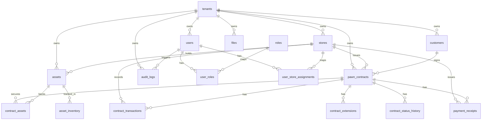

# Architecture

This document describes the current implemented architecture in the repository. It is intentionally grounded in the codebase as it exists today, including known gaps between the intended design and the current wiring.

## System Overview

| Component | Location | Responsibility |
| --- | --- | --- |
| API Gateway | `apps/api-gateway/` | Auth, tenant-aware business APIs, validation, i18n-aware error handling |
| Web Portal | `apps/web/` | Browser UI for platform admin, tenant admin, managers, and staff |
| Mobile App | `apps/mobile/` | Lightweight staff app for lookup, due lists, notes, and photo workflows |
| Domain Libraries | `libs/*` | Business modules split by responsibility |
| Database | PostgreSQL | Shared-schema multi-tenant data store |
| File Storage | MinIO | Private object storage with presigned URLs |

Current runtime shape:

```text
apps/
  api-gateway/
  web/
  mobile/
libs/
  auth/
  tenants/
  stores/
  users/
  customers/
  assets/
  contracts/
  transactions/
  files/
  reports/
  audit/
  common/
```

## Module Boundaries

| Module | Responsibility |
| --- | --- |
| `auth` | Login, refresh, logout, password change, JWT validation |
| `tenants` | Platform-admin tenant CRUD and status management |
| `stores` | Store CRUD, status changes, manager assignment |
| `users` | Tenant users, role assignment, store assignment |
| `customers` | Customer profiles and contract history lookup |
| `assets` | Pawned asset records and inventory location data |
| `contracts` | Contract creation, status transitions, due-date views, contract code generation |
| `transactions` | Disbursement, collection, settlement, extension, void workflows |
| `files` | Presigned MinIO upload/download URLs and file metadata |
| `reports` | Dashboard metrics and tabular operational reports |
| `audit` | Audit log query API and reusable audit logging service |
| `common` | Shared guards, decorators, filter, interceptor, and current-user helpers |

## Tenant Isolation

The intended model is shared-database, shared-schema multi-tenancy.

- business tables carry `tenant_id`
- store-scoped tables also carry `store_id`
- JWT payload carries `tenantId`, `role`, and `allowedStoreIds`
- controllers and services derive tenant context from the authenticated user instead of trusting client-supplied `tenant_id`

Current enforcement layers visible in code:

- `AuthGuard('jwt')` is applied broadly on controllers
- service SQL usually filters by `tenant_id`
- `RolesGuard` is applied where role metadata exists
- `TenantGuard` exists in `libs/common/src/guards/tenant.guard.ts`
- `StoreScopeGuard` exists in `libs/common/src/guards/store-scope.guard.ts`

Current caveat:

- `TenantGuard` and `StoreScopeGuard` are present but are not visibly registered globally and do not appear attached to controllers today
- some reads visibly filter by tenant only and do not always apply store-level filtering in the controller layer

## Main Entity Relationships



## Data Flow

### Contract Creation Flow

1. Staff authenticates and receives a JWT with `tenantId` and `allowedStoreIds`.
2. The client creates or selects a customer.
3. The client creates one or more assets.
4. The API validates tenant/store ownership for the store, customer, and assets.
5. The contracts service generates a contract code using `contract_sequences` plus an advisory lock.
6. The API inserts the contract, links assets, updates asset status, and writes contract status history.

### File Upload Flow

1. Client requests `POST /files/upload-url` with `entityType`, `entityId`, filename, MIME type, and size.
2. The files service checks that the target entity belongs to the current tenant.
3. The API returns a presigned PUT URL and object key under `tenants/{tenantId}/...`.
4. The client uploads directly to MinIO.
5. The client calls `POST /files/confirm` so the API can persist metadata in `files`.

### Financial Transaction Flow

1. Client records a transaction through `POST /transactions` or `POST /transactions/extend`.
2. The transactions service validates tenant/store ownership and current contract state.
3. A new row is inserted into `contract_transactions`.
4. Settlement or extension may also update contract status, asset status, asset inventory, and status history.
5. Void operations create another transaction row instead of editing the original one.

## Key Design Decisions

- Modular monolith: the codebase is split by domain modules rather than by technical layer.
- RS256 JWT: access tokens are signed with a private key and validated with a public key.
- Append-only financial model: transactions are intended to be corrected through void, reversal, or adjustment rows rather than updates or deletes.
- Contract code generation: codes follow `{store_code}-{YYYYMM}-{seq}` using `contract_sequences` plus PostgreSQL advisory locking.
- In-repo documentation: the implementation docs live beside the code rather than in an external wiki.

## Current-State Caveats

- `AuditInterceptor` exists but is not visibly wired into controllers or global providers.
- Actual audit writes in the current code are concentrated in auth flows (`LOGIN_FAILED`, `LOGIN`, `LOGOUT`, `CHANGE_PASSWORD`).
- The database migrations and service SQL disagree in several places, including transaction reference fields, asset status names, inventory status names, contract history column names, and one interest type name.
- The web and mobile auth clients expect `access_token`, while the backend returns `accessToken`.
- The web reports page currently calls `/reports/by-store`, `/reports/by-staff`, and `/reports/inventory`, while backend controllers expose `/reports/stores`, `/reports/staff`, and `/reports/assets/inventory`.
- The web audit page calls `/audit-logs`, while the backend exposes `/audit/logs`.
- The web root route `/` is still the default Next.js starter page rather than an application landing route.
