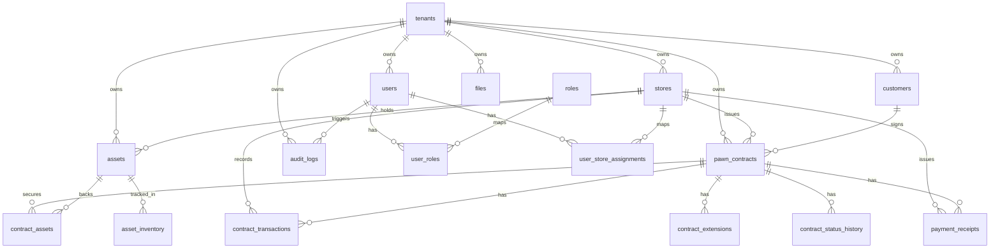

# Kiến trúc hiện trạng — paw8

Tài liệu này mô tả **kiến trúc hiện trạng** của repo `paw8` theo code và docs đang có, không theo planning notes cũ.

Mục tiêu của tài liệu:

- mô tả hình dạng hệ thống hiện tại,
- làm rõ các boundary kiến trúc bắt buộc cho MVP1,
- chỉ ra các khoảng trống giữa **ý định thiết kế** và **wiring/runtime hiện tại**,
- làm baseline cho refactor, QA, docs sync, và OpenSpec changes tiếp theo.

---

## 1. Source of truth

Khi có mâu thuẫn, ưu tiên tham chiếu theo thứ tự:

1. [README](file:///home/beou/IdeaProjects/paw8/README.md)
2. [docs/mvp1-requirements.md](file:///home/beou/IdeaProjects/paw8/docs/mvp1-requirements.md)
3. [docs/database-schema.md](file:///home/beou/IdeaProjects/paw8/docs/database-schema.md)
4. [docs/api-reference.md](file:///home/beou/IdeaProjects/paw8/docs/api-reference.md)
5. Migrations trong `apps/api-gateway/src/database/migrations/`

Planning-era statements trong `AGENTS.md` không nên được xem là runtime source of truth.

---

## 2. System overview

`paw8` là nền tảng quản lý cửa hàng cầm đồ theo mô hình **multi-tenant SaaS**, phục vụ một cửa hàng đơn lẻ hoặc chuỗi cửa hàng.

### 2.1 Thành phần triển khai

| Thành phần | Vị trí | Vai trò |
| --- | --- | --- |
| API Gateway | `apps/api-gateway/` | Auth, validation, tenant-aware APIs, orchestration nghiệp vụ |
| Web Portal | `apps/web/` | Giao diện quản trị và vận hành cho platform admin, tenant admin, manager, staff |
| Mobile App | `apps/mobile/` | Ứng dụng nhẹ cho lookup, due lists, notes, upload ảnh/giấy tờ |
| Domain Libraries | `libs/*` | Chia domain theo trách nhiệm nghiệp vụ |
| PostgreSQL | runtime DB | Shared-schema multi-tenant data store |
| MinIO | object storage | Private file storage với presigned upload/download URLs |

### 2.2 Stack kỹ thuật

| Area | Implementation |
| --- | --- |
| API | NestJS 11, TypeORM, PostgreSQL, `nestjs-i18n` |
| Web | Next.js 16 App Router, React 19, `next-intl`, Axios |
| Mobile | Flutter, Riverpod, Dio, GoRouter, Flutter Secure Storage |
| Database | PostgreSQL 16 |
| File storage | MinIO |
| Auth | RS256 JWT access token + hashed refresh token |
| Tooling | pnpm workspaces, Docker Compose, Bun-based agent tooling |

### 2.3 Runtime shape

```text
apps/
  api-gateway/
  web/
  mobile/
libs/
  auth/
  tenants/
  stores/
  users/
  customers/
  assets/
  contracts/
  transactions/
  files/
  reports/
  audit/
  common/
```

---

## 3. Architectural principles

### 3.1 Tenant là root scope

Mọi domain nghiệp vụ đều nằm dưới `tenant`. `store` là scope con của tenant, không phải root độc lập.

```text
Tenant
 └── Store
      ├── Users
      ├── Customers
      ├── Assets
      ├── Contracts
      ├── Transactions
      ├── Files
      └── Reports
```

### 3.2 Backend không tin `tenant_id` từ client

Tenant context phải được suy ra từ:

- JWT payload,
- current user context,
- allowed store assignments.

`tenant_id` hoặc `store_id` do frontend/mobile gửi lên không được xem là authority source.

### 3.3 Mọi query nghiệp vụ phải tenant-scoped

Mọi read/write dữ liệu nghiệp vụ phải gắn hoặc lọc đúng `tenant_id`.

### 3.4 Store scope là lớp kiểm soát thứ hai

Với dữ liệu gắn với cửa hàng, ngoài `tenant_id` còn phải giới hạn theo `store_id` thuộc `currentUser.allowedStoreIds`.

### 3.5 File access phải tenant-aware và permission-aware

Presigned URL chỉ được cấp sau khi backend xác minh:

- file thuộc tenant hiện tại,
- entity cha thuộc tenant hiện tại,
- nếu entity thuộc store scope thì user có quyền trong store đó.

### 3.6 Financial transactions là append-only

Các correction hợp lệ phải đi qua `void`, `reversal`, hoặc `adjustment`; không sửa/xóa trực tiếp row giao dịch cũ.

### 3.7 API được version từ đầu

Base path mặc định là `/api/v1`.

---

## 4. Domain boundaries

| Module | Trách nhiệm |
| --- | --- |
| `auth` | login, refresh, logout, change password, JWT validation |
| `tenants` | tenant CRUD và status management cho platform admin |
| `stores` | store CRUD, status change, manager assignment |
| `users` | tenant users, role assignment, store assignment |
| `customers` | customer profile và contract history lookup |
| `assets` | tài sản cầm cố và inventory/location |
| `contracts` | contract creation, status transition, due-date views, contract code generation |
| `transactions` | disbursement, collection, extension, settlement, void workflows |
| `files` | presigned URLs và file metadata |
| `reports` | dashboard metrics và operational reports |
| `audit` | audit log query API và audit logging service |
| `common` | guards, decorators, filters, interceptors, current-user helpers |

Nguyên tắc bắt buộc:

- business rules phải có owner rõ ràng theo module,
- orchestration được phép ở service layer,
- không trộn logic lõi một cách tùy tiện giữa nhiều module.

---

## 5. Request context, auth, and authorization

### 5.1 Auth model

- Access token dùng RS256 JWT.
- Refresh token được hash trước khi lưu.
- Auth API hiện gồm `login`, `refresh`, `logout`, `change-password`.

### 5.2 Effective request context

Một request nghiệp vụ hợp lệ về mặt kiến trúc phải được đánh giá trên:

- `currentUser.userId`
- `currentUser.tenantId`
- role set của user
- `currentUser.allowedStoreIds`

### 5.3 Enforcement layers nhìn thấy hiện tại

- `AuthGuard('jwt')` được áp dụng rộng ở controller layer.
- `RolesGuard` được dùng ở các endpoint có metadata `@Roles(...)`.
- Service SQL nhìn chung có filter `tenant_id`.
- `TenantGuard` tồn tại trong `libs/common/src/guards/tenant.guard.ts`.
- `StoreScopeGuard` tồn tại trong `libs/common/src/guards/store-scope.guard.ts`.

### 5.4 Current-state caveat

Hiện chưa thấy bằng chứng wiring đầy đủ rằng:

- `TenantGuard` được register global,
- `StoreScopeGuard` được attach rộng rãi ở controller layer,
- mọi store-scoped read đều enforce store filtering một cách nhất quán từ đầu vào đến truy vấn cuối.

Kết luận kiến trúc: tenant/store isolation là **nguyên tắc bắt buộc**, nhưng chưa nên xem là đã được chứng minh hoàn toàn chỉ bởi wiring hiện có.

---

## 6. Data architecture

### 6.1 Persistence model

Hệ thống dùng **shared database, shared schema multi-tenancy** trên PostgreSQL.

Quy tắc chính:

- phần lớn business tables có `tenant_id`,
- bảng store-scoped có thêm `store_id`,
- unique constraints nên tenant-scoped thay vì global,
- migrations là schema source of truth.

### 6.2 Main tables

Các bảng chính hiện được tài liệu hóa gồm:

- `tenants`
- `tenant_settings`
- `stores`
- `users`
- `roles`
- `user_roles`
- `user_store_assignments`
- `customers`
- `customer_documents`
- `assets`
- `asset_inventory`
- `contract_sequences`
- `pawn_contracts`
- `contract_assets`
- `contract_status_history`
- `contract_transactions`
- `contract_extensions`
- `payment_receipts`
- `files`
- `audit_logs`
- `refresh_tokens`
- `interest_policies`

### 6.3 Entity relationships



### 6.4 Indexing expectations

Các access pattern cốt lõi cần tối ưu quanh:

- `(tenant_id, status)`
- `(tenant_id, store_id, status)`
- `(tenant_id, due_date)`
- `(tenant_id, customer_id)`
- `(tenant_id, entity_type, entity_id)`
- `(tenant_id, created_at)`

---

## 7. File storage architecture

### 7.1 Storage model

- MinIO private bucket
- không dùng public bucket
- object key được prefix theo tenant

Ví dụ:

```text
tenants/{tenant_id}/customers/{customer_id}/id-front.jpg
tenants/{tenant_id}/assets/{asset_id}/photo-1.jpg
tenants/{tenant_id}/contracts/{contract_id}/contract.pdf
tenants/{tenant_id}/receipts/{receipt_id}/receipt.pdf
```

### 7.2 Upload flow

1. Client gọi `POST /files/upload-url` với `entityType`, `entityId`, filename, MIME type, size.
2. Backend xác minh entity thuộc tenant hiện tại.
3. Backend trả presigned PUT URL và object key dưới `tenants/{tenantId}/...`.
4. Client upload trực tiếp lên MinIO.
5. Client gọi `POST /files/confirm` để backend lưu metadata vào `files`.

### 7.3 Download flow

1. Client gọi `GET /files/:id/download-url`.
2. Backend kiểm tra tenant ownership, permission, và store scope nếu có.
3. Backend trả presigned GET URL ngắn hạn.

---

## 8. Core business flows

### 8.1 Contract creation

1. Staff login và nhận JWT chứa `tenantId` và `allowedStoreIds`.
2. Client tạo hoặc chọn customer.
3. Client tạo một hoặc nhiều asset.
4. API validate ownership cho store, customer, và asset.
5. Contracts service sinh `contract_code` theo mẫu `{store_code}-{YYYYMM}-{seq}` bằng `contract_sequences` + advisory lock.
6. API insert contract, link assets, update asset status phù hợp, và ghi `contract_status_history`.

### 8.2 Financial transaction flow

1. Client gọi `POST /transactions` hoặc `POST /transactions/extend`.
2. Transactions service validate tenant/store ownership và current contract state.
3. Insert row mới vào `contract_transactions`.
4. Với settlement/extension, service có thể đồng thời update contract status, asset status, asset inventory, và status history.
5. Void không sửa row cũ mà tạo row giao dịch mới.

### 8.3 Operational reporting flow

Reporting layer hiện phục vụ:

- dashboard metrics,
- by-store report,
- by-staff report,
- asset inventory view,
- due soon / overdue views từ contracts module.

Dashboard/report queries phải tiếp tục tôn trọng tenant scope và, khi phù hợp, store scope.

---

## 9. API surface and client integration

### 9.1 Main route groups

- `/auth/*`
- `/tenants`
- `/stores`
- `/users`
- `/customers`
- `/assets`
- `/contracts`
- `/transactions`
- `/files`
- `/reports/*`
- `/audit/logs`

### 9.2 Integration contract expectations

- backend hiện trả `accessToken`, không phải `access_token`,
- current transaction read endpoint là `GET /transactions/contract/:contractId`, không có `GET /transactions`,
- current report endpoints là `/reports/stores`, `/reports/staff`, `/reports/assets/inventory`,
- current audit endpoint là `/audit/logs`.

---

## 10. Known current-state gaps

### 10.1 Guard wiring chưa rõ ràng

- `TenantGuard` và `StoreScopeGuard` tồn tại nhưng chưa thấy được wire global hoặc attach rộng rãi.

### 10.2 Audit coverage chưa đầy đủ

- `AuditInterceptor` tồn tại nhưng chưa thấy bằng chứng wiring rộng.
- Audit writes hiện tập trung nhiều ở auth flows như `LOGIN_FAILED`, `LOGIN`, `LOGOUT`, `CHANGE_PASSWORD`.

### 10.3 Migration/runtime mismatches

Các mismatch đã được xác nhận giữa migrations và runtime/service SQL:

- `asset_status`: migration dùng `holding`, service dùng `pawned`
- `asset_inventory_status`: migration dùng `in_storage`, service dùng `in_store`
- `interest_type`: migration dùng `per_period`, DTO/runtime dùng `term`
- `contract_status_history`: migration có `from_status` / `to_status`, service có chỗ insert `status`
- `contract_transactions`: migration có `void_of_id`, service có chỗ dùng `reference_transaction_id`

### 10.4 Backend/client route mismatches

- web/mobile auth clients hiện có chỗ mong đợi `access_token`
- web reports page có chỗ gọi `/reports/by-store`, `/reports/by-staff`, `/reports/inventory`
- web audit page có chỗ gọi `/audit-logs`

### 10.5 UX/runtime leftovers

- web root route `/` vẫn là default Next.js starter page thay vì application landing route.

---

## 11. Architectural implications for future changes

Mọi thay đổi tiếp theo nên tuân theo các rule sau:

1. **Không mở rộng business logic như single-tenant app trá hình.**
2. **Schema changes phải đi qua migration files**, không chỉ sửa service SQL.
3. **Route/docs/client changes phải sync cùng nhau** để tránh drift contract.
4. **Guard/interceptor wiring cần được chứng minh bằng runtime usage hoặc controller attachment rõ ràng**, không chỉ bằng file tồn tại.
5. **Financial workflows phải tiếp tục append-only** kể cả khi thêm báo cáo, adjustment, hay settlement variants.

---

## 12. Summary

Kiến trúc hiện tại của `paw8` là một **modular monolith multi-tenant** với:

- NestJS API làm tenant-aware orchestration layer,
- PostgreSQL shared schema làm persistence layer,
- MinIO private storage cho file workflows,
- Next.js web và Flutter mobile làm client surfaces,
- domain boundaries đủ rõ để tiếp tục mở rộng hoặc tách service sau này.

Điểm quan trọng nhất của tài liệu này là: kiến trúc mong muốn và hiện trạng đã khá gần nhau ở mức module/data model, nhưng vẫn còn các khoảng trống rõ ràng ở **guard wiring**, **audit coverage**, **client/backend contract alignment**, và **migration/runtime consistency**.
