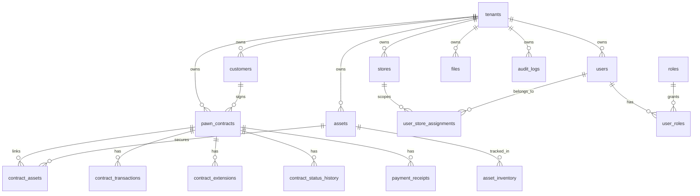

# Database Schema

This guide documents the database schema defined by the TypeORM migration files in `apps/api-gateway/src/database/migrations/`.

## Source of Truth

The source of truth for this document is the migration set, not the current service SQL.

That distinction matters because the current codebase has verified mismatches between migrations and runtime SQL in several areas, including:

- `asset_status`: migrations use `holding`, while services use `pawned`
- `asset_inventory_status`: migrations use `in_storage`, while services use `in_store`
- `interest_type`: migrations use `per_period`, while DTOs use `term`
- `contract_status_history`: migrations define `from_status` and `to_status`, while services insert a `status` column name
- `contract_transactions`: migrations define `void_of_id`, while services reference `reference_transaction_id`

This document describes the schema as created by the migrations and calls out those mismatches explicitly.

## Migration Inventory

| Migration | Scope |
| --- | --- |
| `1700000001000-CreateTenantsAndSettings.ts` | tenants and tenant settings |
| `1700000002000-CreateStoresUsersRolesAssignments.ts` | stores, users, roles, user-role links, user-store links |
| `1700000003000-CreateCustomers.ts` | customers and customer documents |
| `1700000004000-CreateAssets.ts` | assets and asset inventory |
| `1700000005000-CreatePawnContracts.ts` | contract sequences, contracts, contract-assets, status history |
| `1700000006000-CreateTransactions.ts` | transactions, extensions, receipts |
| `1700000007000-CreateFilesAndAuditLogs.ts` | files, audit logs, refresh tokens, interest policies |

## Enum Types

| Enum | Values |
| --- | --- |
| `tenant_status` | `active`, `locked`, `trial`, `expired` |
| `tenant_plan` | `trial`, `basic`, `pro`, `enterprise` |
| `store_status` | `active`, `locked` |
| `user_status` | `active`, `locked` |
| `customer_status` | `active`, `blacklisted` |
| `asset_type` | `motorcycle`, `car`, `phone`, `laptop`, `watch`, `gold_jewelry`, `electronics`, `other` |
| `asset_status` | `holding`, `redeemed`, `overdue`, `pending_liquidation`, `liquidated` |
| `asset_inventory_status` | `in_storage`, `returned` |
| `contract_status` | `draft`, `active`, `near_due`, `overdue`, `extended`, `settled`, `cancelled`, `liquidation_pending`, `liquidated` |
| `interest_type` | `daily`, `monthly`, `per_period` |
| `transaction_type` | `disbursement`, `interest_collection`, `fee_collection`, `principal_partial`, `settlement`, `adjustment`, `void`, `reversal` |
| `payment_method` | `cash`, `bank_transfer`, `other` |

## Core Schema Rules

- Most business tables carry `tenant_id`.
- Store-scoped business data also carries `store_id`.
- Uniqueness is usually tenant-scoped rather than global.
- Financial transactions are intended to be append-only.
- Some tenant and store consistency rules rely on application logic rather than database constraints.

## Tables 1-7

### `tenants`

Purpose: top-level tenant record.

| Column | Type | Null | Default | Notes |
| --- | --- | --- | --- | --- |
| `id` | `uuid` | No | `gen_random_uuid()` | Primary key |
| `name` | `varchar(255)` | No | none | Tenant display name |
| `code` | `varchar(50)` | No | none | Globally unique code |
| `status` | `tenant_status` | No | `trial` | Current tenant state |
| `plan` | `tenant_plan` | No | `trial` | Current plan |
| `max_stores` | `int` | No | `1` | Quota |
| `max_users` | `int` | No | `5` | Quota |
| `trial_end_date` | `timestamptz` | Yes | none | Trial end |
| `created_at` | `timestamptz` | No | `now()` | Timestamp |
| `updated_at` | `timestamptz` | No | `now()` | Timestamp |

Constraints:

- primary key on `id`
- unique on `code`

### `tenant_settings`

Purpose: key-value settings for a tenant.

| Column | Type | Null | Default | Notes |
| --- | --- | --- | --- | --- |
| `id` | `uuid` | No | `gen_random_uuid()` | Primary key |
| `tenant_id` | `uuid` | No | none | FK to `tenants.id` |
| `key` | `varchar(100)` | No | none | Setting name |
| `value` | `text` | Yes | none | Setting value |
| `created_at` | `timestamptz` | No | `now()` | Timestamp |
| `updated_at` | `timestamptz` | No | `now()` | Timestamp |

Constraints:

- unique on `(tenant_id, key)`
- foreign key `tenant_id -> tenants(id)` with `ON DELETE CASCADE`

### `stores`

Purpose: branches belonging to a tenant.

| Column | Type | Null | Default | Notes |
| --- | --- | --- | --- | --- |
| `id` | `uuid` | No | `gen_random_uuid()` | Primary key |
| `tenant_id` | `uuid` | No | none | FK to `tenants.id` |
| `name` | `varchar(255)` | No | none | Store name |
| `code` | `varchar(50)` | No | none | Tenant-scoped code |
| `address` | `text` | Yes | none | Address |
| `phone` | `varchar(20)` | Yes | none | Phone |
| `manager_user_id` | `uuid` | Yes | none | FK to `users.id` |
| `status` | `store_status` | No | `active` | Store state |
| `created_at` | `timestamptz` | No | `now()` | Timestamp |
| `updated_at` | `timestamptz` | No | `now()` | Timestamp |

Constraints:

- unique on `(tenant_id, code)`
- foreign key `tenant_id -> tenants(id)` with `ON DELETE CASCADE`
- foreign key `manager_user_id -> users(id)` with `ON DELETE SET NULL`

### `users`

Purpose: user accounts.

| Column | Type | Null | Default | Notes |
| --- | --- | --- | --- | --- |
| `id` | `uuid` | No | `gen_random_uuid()` | Primary key |
| `tenant_id` | `uuid` | Yes | none | Nullable for platform admins |
| `email` | `varchar(255)` | No | none | Login identifier |
| `phone` | `varchar(20)` | Yes | none | Phone |
| `full_name` | `varchar(255)` | No | none | Display name |
| `password_hash` | `varchar(255)` | No | none | Bcrypt hash |
| `status` | `user_status` | No | `active` | Account state |
| `created_at` | `timestamptz` | No | `now()` | Timestamp |
| `updated_at` | `timestamptz` | No | `now()` | Timestamp |

Constraints:

- unique on `(tenant_id, email)`
- foreign key `tenant_id -> tenants(id)` with `ON DELETE CASCADE`

Current caveat:

- because `tenant_id` is nullable, PostgreSQL may allow multiple rows with the same email when `tenant_id` is `NULL`

### `roles`

Purpose: role records, including platform-wide and tenant-level roles.

| Column | Type | Null | Default | Notes |
| --- | --- | --- | --- | --- |
| `id` | `uuid` | No | `gen_random_uuid()` | Primary key |
| `tenant_id` | `uuid` | Yes | none | Nullable for platform-level roles |
| `name` | `varchar(50)` | No | none | Role name |
| `description` | `text` | Yes | none | Description |
| `created_at` | `timestamptz` | No | `now()` | Timestamp |

Constraints:

- foreign key `tenant_id -> tenants(id)` with `ON DELETE CASCADE`

Current caveat:

- there is no explicit unique constraint on role names

### `user_roles`

Purpose: user-to-role mapping.

| Column | Type | Null | Default | Notes |
| --- | --- | --- | --- | --- |
| `id` | `uuid` | No | `gen_random_uuid()` | Primary key |
| `tenant_id` | `uuid` | Yes | none | Tenant scope |
| `user_id` | `uuid` | No | none | FK to `users.id` |
| `role_id` | `uuid` | No | none | FK to `roles.id` |

Constraints:

- unique on `(user_id, role_id)`
- foreign key `tenant_id -> tenants(id)` with `ON DELETE CASCADE`
- foreign key `user_id -> users(id)` with `ON DELETE CASCADE`
- foreign key `role_id -> roles(id)` with `ON DELETE CASCADE`

### `user_store_assignments`

Purpose: user-to-store mapping.

| Column | Type | Null | Default | Notes |
| --- | --- | --- | --- | --- |
| `id` | `uuid` | No | `gen_random_uuid()` | Primary key |
| `tenant_id` | `uuid` | No | none | Tenant scope |
| `user_id` | `uuid` | No | none | FK to `users.id` |
| `store_id` | `uuid` | No | none | FK to `stores.id` |

Constraints:

- unique on `(user_id, store_id)`
- foreign key `tenant_id -> tenants(id)` with `ON DELETE CASCADE`
- foreign key `user_id -> users(id)` with `ON DELETE CASCADE`
- foreign key `store_id -> stores(id)` with `ON DELETE CASCADE`

## Tables 8-10

### `customers`

Purpose: customer profiles.

| Column | Type | Null | Default | Notes |
| --- | --- | --- | --- | --- |
| `id` | `uuid` | No | `gen_random_uuid()` | Primary key |
| `tenant_id` | `uuid` | No | none | FK to `tenants.id` |
| `full_name` | `varchar(255)` | No | none | Customer name |
| `phone` | `varchar(20)` | Yes | none | Tenant-scoped unique |
| `identity_number` | `varchar(50)` | Yes | none | Tenant-scoped unique |
| `date_of_birth` | `date` | Yes | none | DOB |
| `permanent_address` | `text` | Yes | none | Permanent address |
| `current_address` | `text` | Yes | none | Current address |
| `occupation` | `varchar(100)` | Yes | none | Occupation |
| `emergency_contact_name` | `varchar(255)` | Yes | none | Emergency contact |
| `emergency_contact_phone` | `varchar(20)` | Yes | none | Emergency contact phone |
| `status` | `customer_status` | No | `active` | Customer state |
| `notes` | `text` | Yes | none | Notes |
| `created_at` | `timestamptz` | No | `now()` | Timestamp |
| `updated_at` | `timestamptz` | No | `now()` | Timestamp |

Constraints:

- unique on `(tenant_id, identity_number)`
- unique on `(tenant_id, phone)`
- foreign key `tenant_id -> tenants(id)` with `ON DELETE CASCADE`

### `customer_documents`

Purpose: document records attached to a customer.

| Column | Type | Null | Default | Notes |
| --- | --- | --- | --- | --- |
| `id` | `uuid` | No | `gen_random_uuid()` | Primary key |
| `tenant_id` | `uuid` | No | none | FK to `tenants.id` |
| `customer_id` | `uuid` | No | none | FK to `customers.id` |
| `document_type` | `varchar(50)` | No | none | Document category |
| `file_id` | `uuid` | Yes | none | Intended file reference |
| `created_at` | `timestamptz` | No | `now()` | Timestamp |

Constraints:

- foreign key `tenant_id -> tenants(id)` with `ON DELETE CASCADE`
- foreign key `customer_id -> customers(id)` with `ON DELETE CASCADE`

Current caveat:

- `file_id` has no foreign key to `files`

### `assets`

Purpose: pawnable asset records.

| Column | Type | Null | Default | Notes |
| --- | --- | --- | --- | --- |
| `id` | `uuid` | No | `gen_random_uuid()` | Primary key |
| `tenant_id` | `uuid` | No | none | FK to `tenants.id` |
| `store_id` | `uuid` | No | none | FK to `stores.id` |
| `asset_type` | `asset_type` | No | none | Asset category |
| `asset_name` | `varchar(255)` | No | none | Display name |
| `brand` | `varchar(100)` | Yes | none | Brand |
| `model` | `varchar(100)` | Yes | none | Model |
| `color` | `varchar(50)` | Yes | none | Color |
| `serial_number` | `varchar(100)` | Yes | none | Serial |
| `imei` | `varchar(50)` | Yes | none | IMEI |
| `license_plate` | `varchar(20)` | Yes | none | License plate |
| `chassis_number` | `varchar(100)` | Yes | none | Chassis number |
| `engine_number` | `varchar(100)` | Yes | none | Engine number |
| `condition_description` | `text` | Yes | none | Condition notes |
| `valuation_amount` | `numeric(18,2)` | Yes | none | Appraised value |
| `proposed_loan_amount` | `numeric(18,2)` | Yes | none | Proposed loan |
| `status` | `asset_status` | No | `holding` | Asset state |
| `created_at` | `timestamptz` | No | `now()` | Timestamp |
| `updated_at` | `timestamptz` | No | `now()` | Timestamp |

Constraints:

- foreign key `tenant_id -> tenants(id)` with `ON DELETE CASCADE`
- foreign key `store_id -> stores(id)`

## Tables 11-14

### `asset_inventory`

Purpose: physical storage tracking for assets.

| Column | Type | Null | Default | Notes |
| --- | --- | --- | --- | --- |
| `id` | `uuid` | No | `gen_random_uuid()` | Primary key |
| `tenant_id` | `uuid` | No | none | FK to `tenants.id` |
| `store_id` | `uuid` | No | none | FK to `stores.id` |
| `asset_id` | `uuid` | No | none | FK to `assets.id` |
| `location_code` | `varchar(100)` | Yes | none | Location identifier |
| `location_note` | `text` | Yes | none | Location note |
| `received_at` | `timestamptz` | No | `now()` | Received timestamp |
| `returned_at` | `timestamptz` | Yes | none | Returned timestamp |
| `status` | `asset_inventory_status` | No | `in_storage` | Inventory state |
| `created_at` | `timestamptz` | No | `now()` | Timestamp |

Constraints:

- foreign key `tenant_id -> tenants(id)` with `ON DELETE CASCADE`
- foreign key `store_id -> stores(id)`
- foreign key `asset_id -> assets(id)`

### `contract_sequences`

Purpose: monthly running sequence state for contract code generation.

| Column | Type | Null | Default | Notes |
| --- | --- | --- | --- | --- |
| `id` | `uuid` | No | `gen_random_uuid()` | Primary key |
| `tenant_id` | `uuid` | No | none | FK to `tenants.id` |
| `store_id` | `uuid` | No | none | FK to `stores.id` |
| `year_month` | `char(6)` | No | none | `YYYYMM` bucket |
| `last_seq` | `int` | No | `0` | Last issued number |

Constraints:

- unique on `(tenant_id, store_id, year_month)`
- foreign key `tenant_id -> tenants(id)`
- foreign key `store_id -> stores(id)`

### `pawn_contracts`

Purpose: pawn contract header record.

| Column | Type | Null | Default | Notes |
| --- | --- | --- | --- | --- |
| `id` | `uuid` | No | `gen_random_uuid()` | Primary key |
| `tenant_id` | `uuid` | No | none | FK to `tenants.id` |
| `store_id` | `uuid` | No | none | FK to `stores.id` |
| `customer_id` | `uuid` | No | none | FK to `customers.id` |
| `contract_code` | `varchar(100)` | No | none | Tenant-scoped unique contract code |
| `principal_amount` | `numeric(18,2)` | No | none | Principal |
| `interest_rate` | `numeric(8,4)` | No | none | Interest rate |
| `interest_type` | `interest_type` | No | `monthly` | Interest model |
| `start_date` | `date` | No | none | Start date |
| `due_date` | `date` | No | none | Due date |
| `status` | `contract_status` | No | `draft` | Contract state |
| `notes` | `text` | Yes | none | Notes |
| `created_by` | `uuid` | No | none | FK to `users.id` |
| `updated_by` | `uuid` | Yes | none | FK to `users.id` |
| `created_at` | `timestamptz` | No | `now()` | Timestamp |
| `updated_at` | `timestamptz` | No | `now()` | Timestamp |

Constraints:

- unique on `(tenant_id, contract_code)`
- foreign key `tenant_id -> tenants(id)` with `ON DELETE CASCADE`
- foreign key `store_id -> stores(id)`
- foreign key `customer_id -> customers(id)`
- foreign key `created_by -> users(id)`
- foreign key `updated_by -> users(id)`

### `contract_assets`

Purpose: many-to-many link between contracts and assets.

| Column | Type | Null | Default | Notes |
| --- | --- | --- | --- | --- |
| `id` | `uuid` | No | `gen_random_uuid()` | Primary key |
| `tenant_id` | `uuid` | No | none | FK to `tenants.id` |
| `contract_id` | `uuid` | No | none | FK to `pawn_contracts.id` |
| `asset_id` | `uuid` | No | none | FK to `assets.id` |

Constraints:

- unique on `(contract_id, asset_id)`
- foreign key `tenant_id -> tenants(id)`
- foreign key `contract_id -> pawn_contracts(id)` with `ON DELETE CASCADE`
- foreign key `asset_id -> assets(id)`

### `contract_status_history`

Purpose: contract status transition history.

| Column | Type | Null | Default | Notes |
| --- | --- | --- | --- | --- |
| `id` | `uuid` | No | `gen_random_uuid()` | Primary key |
| `tenant_id` | `uuid` | No | none | FK to `tenants.id` |
| `contract_id` | `uuid` | No | none | FK to `pawn_contracts.id` |
| `from_status` | `contract_status` | Yes | none | Previous state |
| `to_status` | `contract_status` | No | none | New state |
| `note` | `text` | Yes | none | Reason or note |
| `changed_by` | `uuid` | Yes | none | FK to `users.id` |
| `created_at` | `timestamptz` | No | `now()` | Timestamp |

Constraints:

- foreign key `tenant_id -> tenants(id)`
- foreign key `contract_id -> pawn_contracts(id)` with `ON DELETE CASCADE`
- foreign key `changed_by -> users(id)`

Current caveat:

- service SQL currently inserts different column names than the migration defines

## Tables 15-18

### `contract_transactions`

Purpose: financial transaction ledger for a contract.

| Column | Type | Null | Default | Notes |
| --- | --- | --- | --- | --- |
| `id` | `uuid` | No | `gen_random_uuid()` | Primary key |
| `tenant_id` | `uuid` | No | none | FK to `tenants.id` |
| `store_id` | `uuid` | No | none | FK to `stores.id` |
| `contract_id` | `uuid` | No | none | FK to `pawn_contracts.id` |
| `transaction_type` | `transaction_type` | No | none | Ledger event type |
| `amount` | `numeric(18,2)` | No | none | Positive or corrective amount |
| `payment_method` | `payment_method` | No | `cash` | Payment channel |
| `transaction_date` | `timestamptz` | No | `now()` | Business event time |
| `note` | `text` | Yes | none | Notes |
| `void_of_id` | `uuid` | Yes | none | Self-FK to original row |
| `created_by` | `uuid` | No | none | FK to `users.id` |
| `created_at` | `timestamptz` | No | `now()` | Timestamp |

Constraints:

- foreign key `tenant_id -> tenants(id)`
- foreign key `store_id -> stores(id)`
- foreign key `contract_id -> pawn_contracts(id)`
- foreign key `void_of_id -> contract_transactions(id)`
- foreign key `created_by -> users(id)`

Current caveat:

- the append-only rule is documented in migration intent and application logic, not enforced with a database trigger
- service SQL currently references `reference_transaction_id` instead of `void_of_id`

### `contract_extensions`

Purpose: extension history for a contract.

| Column | Type | Null | Default | Notes |
| --- | --- | --- | --- | --- |
| `id` | `uuid` | No | `gen_random_uuid()` | Primary key |
| `tenant_id` | `uuid` | No | none | FK to `tenants.id` |
| `contract_id` | `uuid` | No | none | FK to `pawn_contracts.id` |
| `old_due_date` | `date` | No | none | Previous due date |
| `new_due_date` | `date` | No | none | New due date |
| `interest_paid_amount` | `numeric(18,2)` | No | `0` | Interest collected |
| `fee_amount` | `numeric(18,2)` | No | `0` | Extension fee |
| `created_by` | `uuid` | No | none | FK to `users.id` |
| `created_at` | `timestamptz` | No | `now()` | Timestamp |

Constraints:

- foreign key `tenant_id -> tenants(id)`
- foreign key `contract_id -> pawn_contracts(id)`
- foreign key `created_by -> users(id)`

### `payment_receipts`

Purpose: receipt metadata for recorded payments.

| Column | Type | Null | Default | Notes |
| --- | --- | --- | --- | --- |
| `id` | `uuid` | No | `gen_random_uuid()` | Primary key |
| `tenant_id` | `uuid` | No | none | FK to `tenants.id` |
| `store_id` | `uuid` | No | none | FK to `stores.id` |
| `contract_id` | `uuid` | No | none | FK to `pawn_contracts.id` |
| `transaction_id` | `uuid` | Yes | none | FK to `contract_transactions.id` |
| `receipt_number` | `varchar(100)` | No | none | Tenant-scoped unique receipt number |
| `amount` | `numeric(18,2)` | No | none | Receipt amount |
| `issued_at` | `timestamptz` | No | `now()` | Issue time |
| `issued_by` | `uuid` | No | none | FK to `users.id` |

Constraints:

- unique on `(tenant_id, receipt_number)`
- foreign key `tenant_id -> tenants(id)`
- foreign key `store_id -> stores(id)`
- foreign key `contract_id -> pawn_contracts(id)`
- foreign key `transaction_id -> contract_transactions(id)`
- foreign key `issued_by -> users(id)`

## Tables 19-22

### `files`

Purpose: file metadata for MinIO objects.

| Column | Type | Null | Default | Notes |
| --- | --- | --- | --- | --- |
| `id` | `uuid` | No | `gen_random_uuid()` | Primary key |
| `tenant_id` | `uuid` | No | none | FK to `tenants.id` |
| `store_id` | `uuid` | Yes | none | FK to `stores.id` |
| `entity_type` | `varchar(50)` | No | none | Polymorphic target type |
| `entity_id` | `uuid` | No | none | Polymorphic target id |
| `bucket` | `varchar(100)` | No | none | Bucket name |
| `object_key` | `text` | No | none | Unique object key |
| `original_filename` | `varchar(255)` | Yes | none | Original filename |
| `mime_type` | `varchar(100)` | Yes | none | MIME type |
| `file_size` | `bigint` | Yes | none | File size |
| `uploaded_by` | `uuid` | No | none | FK to `users.id` |
| `created_at` | `timestamptz` | No | `now()` | Timestamp |

Constraints:

- unique on `object_key`
- foreign key `tenant_id -> tenants(id)`
- foreign key `store_id -> stores(id)`
- foreign key `uploaded_by -> users(id)`

Current caveat:

- `entity_type` and `entity_id` are polymorphic and therefore not protected by a normal foreign key

### `audit_logs`

Purpose: immutable audit trail storage.

| Column | Type | Null | Default | Notes |
| --- | --- | --- | --- | --- |
| `id` | `uuid` | No | `gen_random_uuid()` | Primary key |
| `tenant_id` | `uuid` | Yes | none | FK to `tenants.id` |
| `store_id` | `uuid` | Yes | none | FK to `stores.id` |
| `user_id` | `uuid` | Yes | none | FK to `users.id` |
| `action` | `varchar(100)` | No | none | Audit action |
| `entity_type` | `varchar(50)` | Yes | none | Entity type |
| `entity_id` | `uuid` | Yes | none | Entity id |
| `old_value` | `jsonb` | Yes | none | Previous snapshot |
| `new_value` | `jsonb` | Yes | none | New snapshot |
| `ip_address` | `inet` | Yes | none | Request IP |
| `user_agent` | `text` | Yes | none | User agent |
| `created_at` | `timestamptz` | No | `now()` | Timestamp |

Constraints:

- foreign key `tenant_id -> tenants(id)`
- foreign key `store_id -> stores(id)`
- foreign key `user_id -> users(id)`

### `refresh_tokens`

Purpose: hashed refresh token store.

| Column | Type | Null | Default | Notes |
| --- | --- | --- | --- | --- |
| `id` | `uuid` | No | `gen_random_uuid()` | Primary key |
| `user_id` | `uuid` | No | none | FK to `users.id` |
| `token_hash` | `varchar(255)` | No | none | SHA256 hash |
| `expires_at` | `timestamptz` | No | none | Expiry |
| `revoked_at` | `timestamptz` | Yes | none | Revocation timestamp |
| `created_at` | `timestamptz` | No | `now()` | Timestamp |

Constraints:

- foreign key `user_id -> users(id)` with `ON DELETE CASCADE`

### `interest_policies`

Purpose: tenant-level interest policy records.

| Column | Type | Null | Default | Notes |
| --- | --- | --- | --- | --- |
| `id` | `uuid` | No | `gen_random_uuid()` | Primary key |
| `tenant_id` | `uuid` | No | none | FK to `tenants.id` |
| `asset_type` | `varchar(50)` | Yes | none | Optional asset-specific scope |
| `interest_rate` | `numeric(8,4)` | No | none | Rate |
| `interest_type` | `varchar(20)` | No | `monthly` | Interest mode |
| `is_default` | `boolean` | No | `false` | Default flag |
| `created_at` | `timestamptz` | No | `now()` | Timestamp |

Constraints:

- foreign key `tenant_id -> tenants(id)`

## Indexes

| Index | Table | Columns | Rationale |
| --- | --- | --- | --- |
| `idx_tenant_settings_tenant` | `tenant_settings` | `(tenant_id)` | tenant-level settings lookup |
| `idx_stores_tenant_status` | `stores` | `(tenant_id, status)` | store list and status filters |
| `idx_users_tenant_status` | `users` | `(tenant_id, status)` | user list and status filters |
| `idx_user_roles_user` | `user_roles` | `(user_id)` | role lookup for a user |
| `idx_user_store_assignments_user` | `user_store_assignments` | `(user_id, store_id)` | store resolution for a user |
| `idx_user_store_assignments_store` | `user_store_assignments` | `(store_id)` | reverse lookup by store |
| `idx_customers_tenant_phone` | `customers` | `(tenant_id, phone)` | phone search and duplicate check |
| `idx_customers_tenant_identity` | `customers` | `(tenant_id, identity_number)` | identity search and duplicate check |
| `idx_customers_tenant_status` | `customers` | `(tenant_id, status)` | customer status filters |
| `idx_customer_docs_customer` | `customer_documents` | `(customer_id)` | customer document lookup |
| `idx_assets_tenant_store_status` | `assets` | `(tenant_id, store_id, status)` | asset inventory and search |
| `idx_assets_tenant_imei` | `assets` | `(tenant_id, imei)` | IMEI lookup |
| `idx_assets_tenant_license_plate` | `assets` | `(tenant_id, license_plate)` | license plate lookup |
| `idx_assets_tenant_serial` | `assets` | `(tenant_id, serial_number)` | serial lookup |
| `idx_asset_inventory_asset` | `asset_inventory` | `(asset_id)` | inventory by asset |
| `idx_asset_inventory_tenant_store` | `asset_inventory` | `(tenant_id, store_id, status)` | storage inventory lookup |
| `idx_contracts_tenant_store_status` | `pawn_contracts` | `(tenant_id, store_id, status)` | contract lists by store/state |
| `idx_contracts_tenant_due_date` | `pawn_contracts` | `(tenant_id, due_date)` | upcoming and overdue queries |
| `idx_contracts_tenant_customer` | `pawn_contracts` | `(tenant_id, customer_id)` | customer contract history |
| `idx_contracts_tenant_code` | `pawn_contracts` | `(tenant_id, contract_code)` | contract code lookup |
| `idx_contract_status_history_contract` | `contract_status_history` | `(contract_id)` | status timeline lookup |
| `idx_transactions_tenant_store_date` | `contract_transactions` | `(tenant_id, store_id, transaction_date)` | ledger reporting by store/date |
| `idx_transactions_contract` | `contract_transactions` | `(contract_id)` | contract ledger lookup |
| `idx_extensions_contract` | `contract_extensions` | `(contract_id)` | extension history |
| `idx_receipts_contract` | `payment_receipts` | `(contract_id)` | receipt lookup by contract |
| `idx_files_tenant_entity` | `files` | `(tenant_id, entity_type, entity_id)` | files by entity |
| `idx_audit_tenant_created_at` | `audit_logs` | `(tenant_id, created_at)` | audit browsing over time |
| `idx_audit_user` | `audit_logs` | `(user_id)` | audit lookup by user |
| `idx_refresh_tokens_user` | `refresh_tokens` | `(user_id)` | active token lookup and revocation |
| `idx_interest_policies_tenant` | `interest_policies` | `(tenant_id)` | tenant interest policy lookup |

## Core ERD

## Append-Only Transactions

The intended financial rule is append-only transaction history.

Visible schema support:

- `contract_transactions` stores every event as its own row
- `transaction_type` includes `adjustment`, `void`, and `reversal`
- `void_of_id` allows one transaction to reference the row it corrects

Current caveat:

- the append-only rule is not enforced by a database trigger or rule in the migrations
- correctness currently depends on application logic

## Additional Schema Caveats

- `roles` has no uniqueness constraint
- `users(tenant_id, email)` can allow duplicate global-platform emails because `tenant_id` is nullable
- `customer_documents.file_id` has no FK to `files`
- `files(entity_type, entity_id)` is polymorphic and not backed by standard foreign keys
- many cross-table tenant consistency rules depend on service-layer checks instead of composite foreign keys
